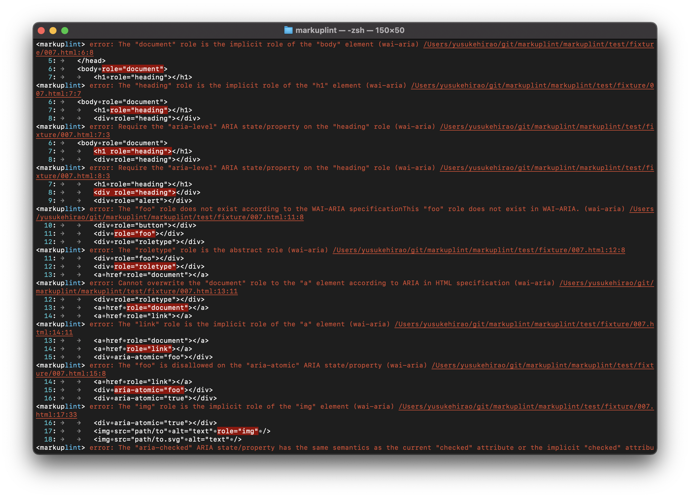

# 

[](https://badge.fury.io/js/markuplint)
[](https://travis-ci.org/markuplint/markuplint) [](https://coveralls.io/github/markuplint/markuplint?branch=next)

A Linter for All Markup Languages (for legacy/modern HTML, Web Components, SVG, MathML, AMP HTML and more).

## Install

```
$ npm install -D markuplint
$ yarn add -D markuplint
```

Supported for _Node.js_ `v12.4.0` or later.

## Usage

### CLI

```
$ npx markuplint verifyee.html
```

```
$ npx markuplint --help

Usage
	$ markuplint <HTML file pathes (glob format)>
	$ <stdout> | markuplint

Options
	--ruleset,      -r FILE_PATH  Ruleset file path.
	--no-color,     -c            Output no color.
	--format,       -f FORMAT     Output format. Support "JSON" or "Simple". Default "JSON".
	--problem-only, -p            Output only problems, without passeds.

	--help,         -h            Show help.
	--version,      -v            Show version.

Examples
	$ markuplint verifyee.html --ruleset path/to/.markuplintrc
	$ cat verifyee.html | markuplint
```



### API

```ts
import { verify, fix, exec } from 'markuplint';

// Standard usage
const result = verify(htmlCode, config, rules);

// Standard fix
const fixedCode = verify(htmlCode, config, rules);

// Custom usage
const result = exec({
	files,
	workspaceDir,
	config,
	specs,
	rules,
});
```

#### 📖 API Document

[API Document](https://api.markuplint.dev) genereated by typedoc.

## Configuration

`.markuplintrc` JSON or YAML format

```json
{
	"extends": "@markuplint/html-ls",
	"rules": {
		"rule__enabled": true,
		"rule__disabled": false,
		"rule__custom-setting": {
			"severity": "error",
			"value": "VALUE"
		},
		"rule__custom-setting-with-detail-option": {
			"value": "VALUE",
			"option": { "OPTIONAL_PROP": "OPTIONAL_VALUE" }
		}
	},
	"nodeRules": [
		{
			"tagName": "div",
			"rules": {
				"rule__disable-for-div-tag": false
			}
		}
	],
	"childNodeRules": [
		{
			"selector": "[data-attr^=\"value\"]",
			"inheritance": true,
			"rules": {
				"rule__overwrite-setting-of-selector-matched-element": {
					"value": "OVERWROTE_VALUE"
				}
			}
		}
	]
}
```

Details and Documentation **🚧WIP**

## Rules

Details and Documentation **🚧WIP**

### Rule Customization

Details and Documentation **🚧WIP**

## Editor Extensions

## Thanks

This linter is inspired by:

-   [HTMLHint](http://htmlhint.com/)
-   [ESLint](https://eslint.org/)
-   [stylelint](https://stylelint.io/)
-   [textlint](https://textlint.github.io/)
